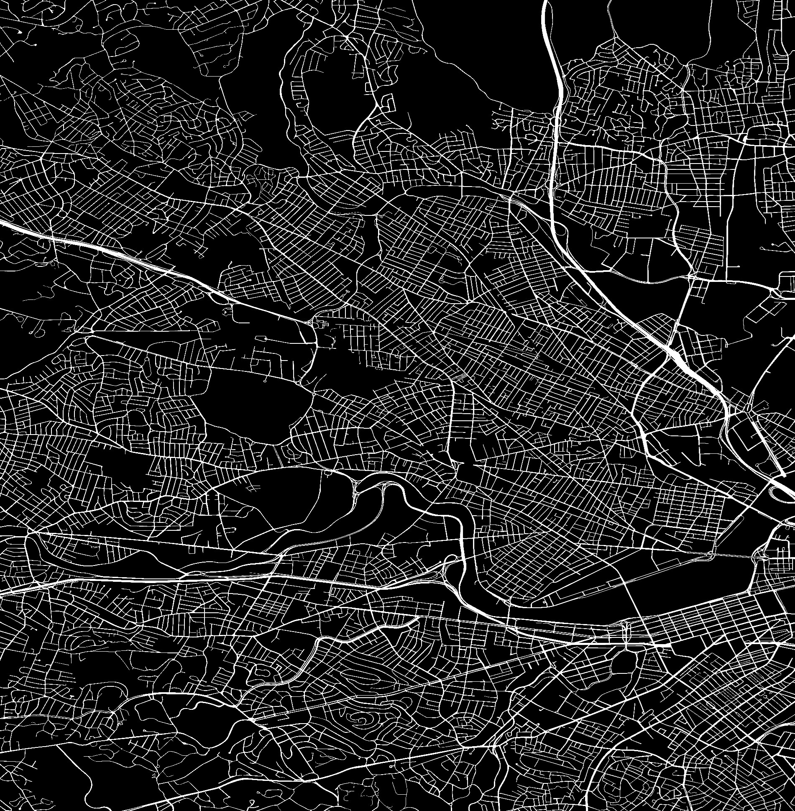
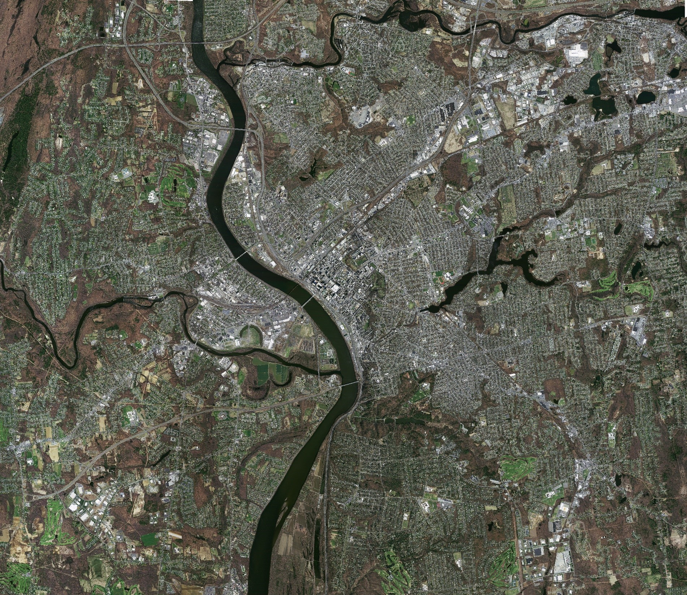
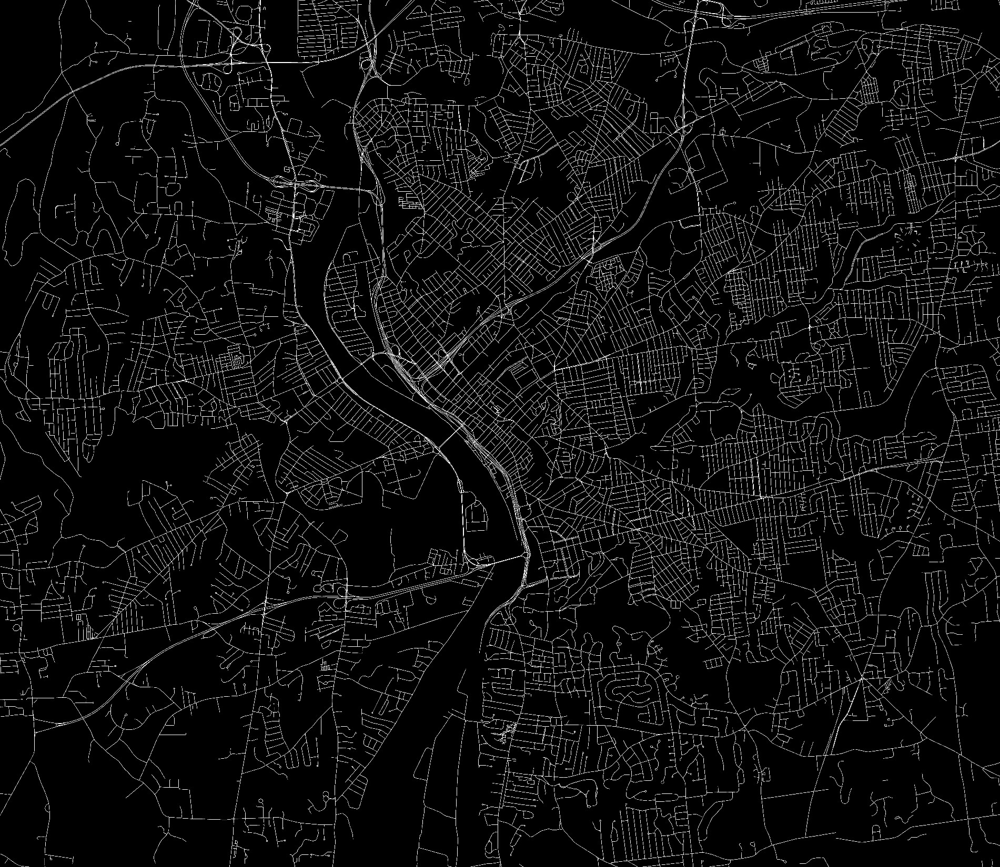

# Large Scale Images
The experimental data support files for the paper titled "A Multi-Scale and Multi-Direction Fusion Network for Road Detection From Satellite Imagery".

# Image Display
|               Boston               | Boston Road |
|:----------------------------------:|:---:|
|  |  |

| Massachusetts | Massachusetts Road |
|:---:|:---:|
|  |  |

# Image Information
- **Massachusetts**
  - Range: 14116*16273
  - Resolution: 1m/pixel
- **Boston**
  - Range: 23104*23552
  - Resolution: 0.44m/pixel

# Download
The above images are compressed versions. The original data can be found at the link below:
- URL: [https://pan.baidu.com/s/1wup291QUFCzFKYbjtc7LBg](https://pan.baidu.com/s/1wup291QUFCzFKYbjtc7LBg)
- Key: 2521 

# References
- Boston is from [http://rsidea.whu.edu.cn/resource_LSRV_sharing.htm](http://rsidea.whu.edu.cn/resource_LSRV_sharing.htm)
- Massachusetts is from [https://www.kaggle.com/datasets/balraj98/massachusetts-roads-dataset](https://www.kaggle.com/datasets/balraj98/massachusetts-roads-dataset)
